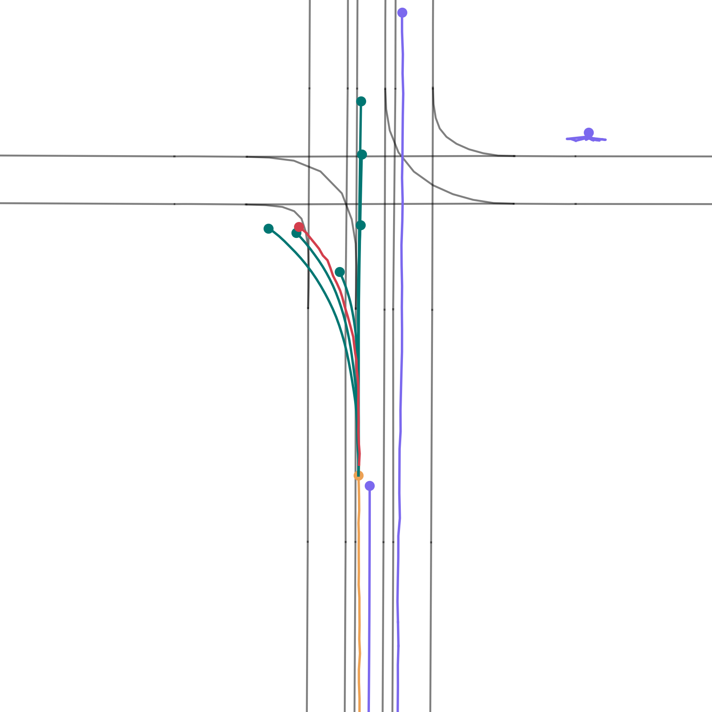
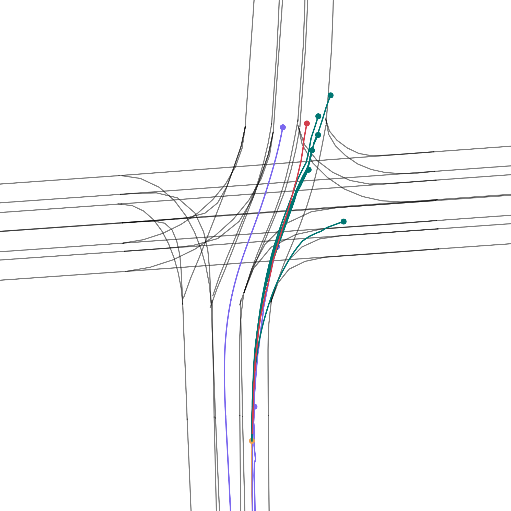
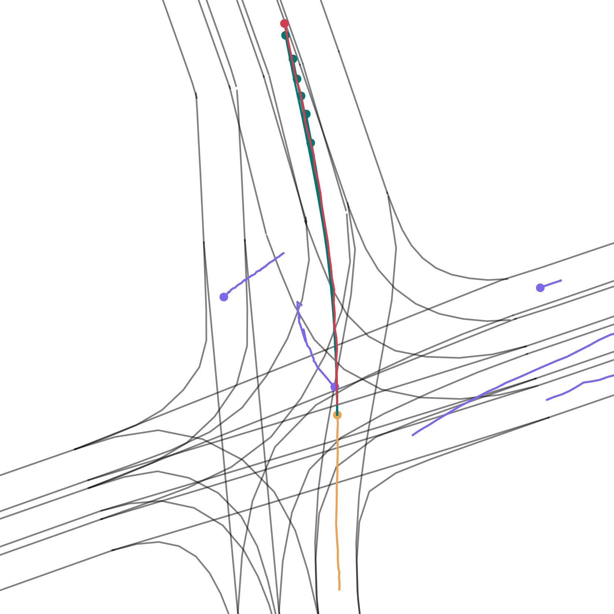

# FutuTP: Future-based Trajectory Prediction for Autonomous Driving
## Introduction
This is the project page of the paper

* "FutuTP: Future-based Trajectory Prediction for Autonomous Driving"

* Notice: The code will be released after the publishing of this paper.

## Qualitative Results

* On Argoverse 1 motion forecasting dataset

  
  
  

## License
This repository is licensed under [MIT license](https://github.com/HKUST-Aerial-Robotics/SIMPL/blob/main/LICENSE).
