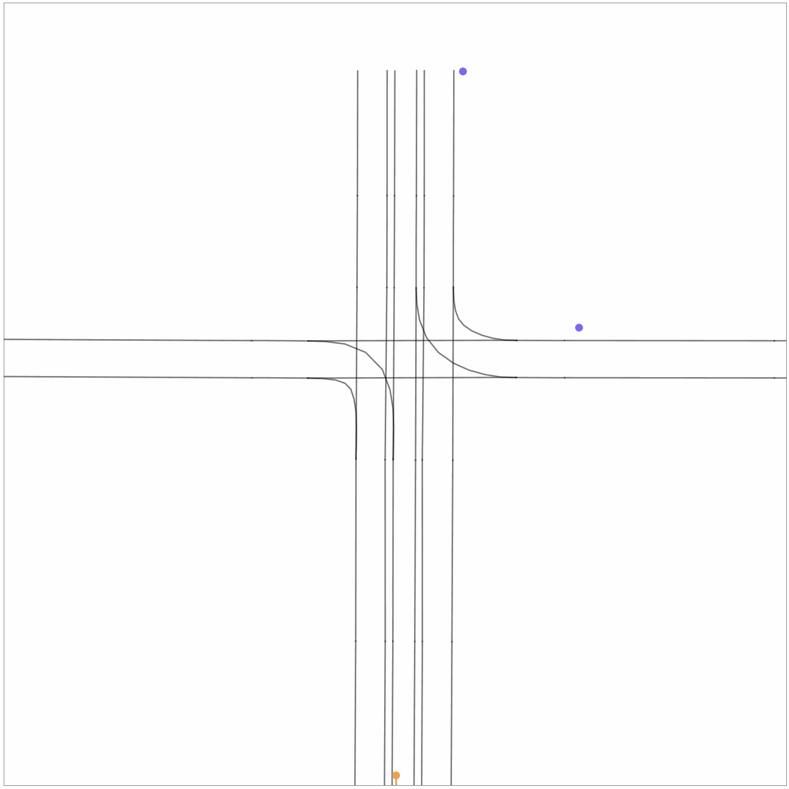
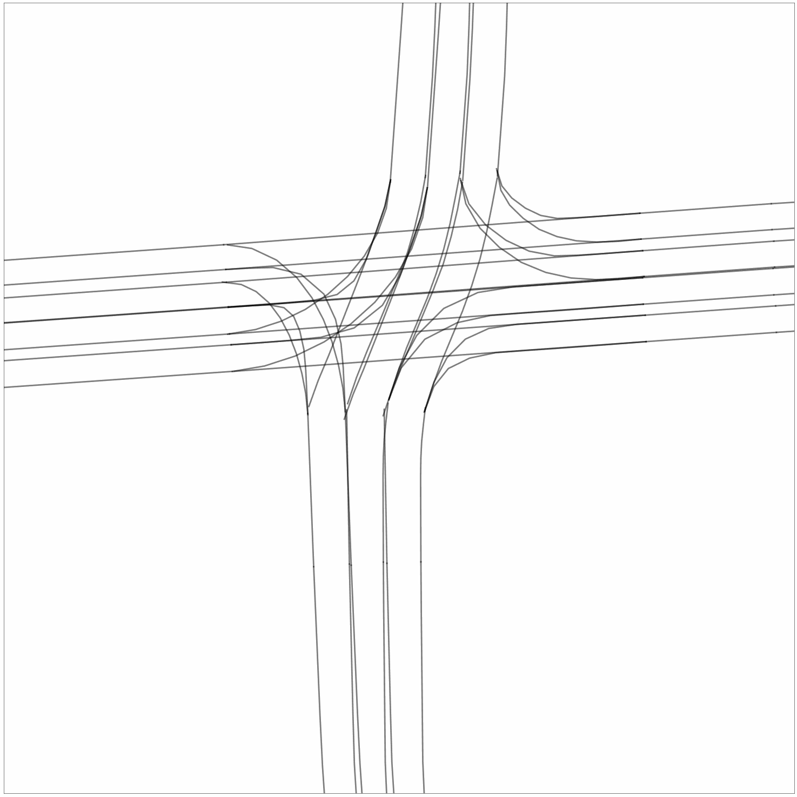
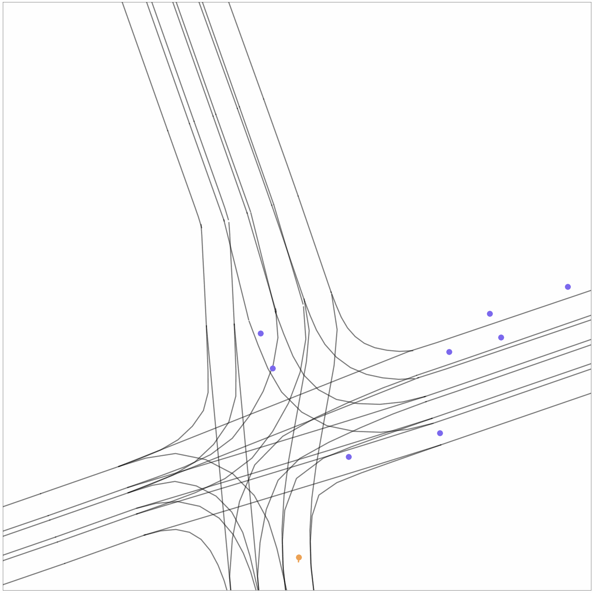

# FutuTP: Future-based Trajectory Prediction for Autonomous Driving

## Introduction
This is the project page of the paper

* "FutuTP: Future-based Trajectory Prediction for Autonomous Driving"


## Qualitative Results

* On Argoverse 1 motion forecasting dataset

<p align="center">
  
  
  
</p>

## Quantitative Results

Result on Argoverse 1 test set:

| Models | brier-minFDE_6 | minFDE_6 | minADE_6 | MR_6 |
| :--- | :---: | :---: | :---: | :---: |
|FutuTP | 1.84 | 1.17 | 0.77 | 0.125 |

Result on nuScenes test set:
| Models | minADE_5 | minADE_10 | MR_5 | MR_10 |
| :--- | :---: | :---: | :---: |:---: |
|FutuTP | 1.23 | 0.94 | 0.50 | 0.32 |

## Getting Started

### Install dependencies
1. Create a new conda virtual env
```
conda create --name FutuTP python=3.8
conda activate FutuTP
```

2. Install PyTorch according to your CUDA version. We recommend CUDA >= 12.1, PyTorch >= 2.1.0.
```
pip install torch==2.1.0 torchvision==0.16.0 torchaudio==2.1.0 --index-url https://download.pytorch.org/whl/cu121
```

3. Install Argoverse 1 API, please follow [argoverse-api](https://github.com/argoai/argoverse-api).

4. Install nuScenes
```
pip install nuscenes-devkit
```
- Download the [nuScenes dataset](https://www.nuscenes.org/download). For this project we just need the following.
    - Metadata for the Trainval split (v1.0)
    - Map expansion pack (v1.3)
- Organize the nuScenes root directory as follows
```plain
└── nuScenes/
    ├── maps/
    |   ├── basemaps/
    |   ├── expansion/
    |   ├── prediction/
    |   ├── 36092f0b03a857c6a3403e25b4b7aab3.png
    |   ├── 37819e65e09e5547b8a3ceaefba56bb2.png
    |   ├── 53992ee3023e5494b90c316c183be829.png
    |   └── 93406b464a165eaba6d9de76ca09f5da.png
    └── v1.0-trainval
        ├── attribute.json
        ├── calibrated_sensor.json
        ...
        └── visibility.json         
```

5. Install other dependencies
```
pip install -r requirements.txt
```

### Train/Evaluate FutuTP using Argoverse 1

#### 1) Train (First Stage)
Suppose the training data of Argoverse 1 is at ```./train/data/```.
```bash
OUTPUT_DIR=checkpoints/argoverse1.fututp.s1; \
GPU_NUM=4; \
python src/train.py --do_train --data_dir ./train/data --future_frame_num 30 \
  --hidden_size 128 --train_all --vector_size 32 --train_batch_size 128 --core_num 32 \
  --num_train_epochs 9 --subdivide_length 5 --topk 2 --lane_loss_weight 10 --use_map \
  --use_centerline --distributed_training ${GPU_NUM} --output_dir ${OUTPUT_DIR} \
  --other_params \
  semantic_lane direction step_lane_score enhance_global_graph point_level-4-3
``` 

#### 2) Train (Second Stage)
```bash
OUTPUT_DIR=checkpoints/argoverse1.fututp.s2; \
GPU_NUM=4; \
MODEL_PATH=checkpoints/argoverse1.fututp.s1/model_save/model.9.bin; \
python src/train.py --do_train --data_dir ./train/data --future_frame_num 30 \
  --hidden_size 128 --train_all --vector_size 32 --train_batch_size 128 --core_num 32 \
  --num_train_epochs 9 --subdivide_length 5 --topk 2 --lane_loss_weight 10 --use_map \
  --use_centerline --distributed_training ${GPU_NUM} --output_dir ${OUTPUT_DIR} --learning_rate 0.0003 \
  --other_params \
  semantic_lane direction step_lane_score enhance_global_graph point_level-4-3 \
  stage_two stage-two-train_recover=${MODEL_PATH} stage-two-epoch=9
```


#### 3) Evaluate
Suppose the validation data of Argoverse motion forecasting is at ```./val/data/```.
```bash
OUTPUT_DIR=checkpoints/argoverse1.fututp.s2; \
GPU_NUM=1; \
python src/eval.py --do_eval --data_dir_for_val ./val/data/ --future_frame_num 30 \
  --hidden_size 128 --vector_size 32 --eval_batch_size 128 --core_num 16 \
  --subdivide_length 5 --topk 2 --use_map --use_centerline --model_recover_path 9 \
  --distributed_training ${GPU_NUM} --output_dir ${OUTPUT_DIR} \
  --other_params \
  semantic_lane direction step_lane_score enhance_global_graph point_level-4-3 stage_two
 ```

### Train/Evaluate FutuTP using nuScenes
#### 1) Pre-processed data
```shell
python src/datascripts/dataloader_nuscenes.py --DATAROOT path/to/nuScenes/root/directory --STOREDIR path/to/directory/with/preprocessed/data 
```
#### 2) Train (First Stage)
Suppose the processed training data of NuScenes is at ```checkpoints/nuscenes.fututp/temp_file```.
```bash
OUTPUT_DIR=checkpoints/nuscenes.fututp; \
GPU_NUM=4; \
python src/train.py --do_train --future_frame_num 12 --hidden_size 64 \
  --train_batch_size 32 --num_train_epochs 50 --lane_loss_weight 0.9 --topk 2 \
  --distributed_training ${GPU_NUM} --output_dir ${OUTPUT_DIR} --reuse_temp_file \
  --other_params \
  semantic_lane direction step_lane_score enhance_global_graph point_level-4-3 \
  nuscenes nuscenes_mode_num=5
```

#### 3) Train (Second Stage)
```bash
OUTPUT_DIR=checkpoints/nuscenes.fututp; \
GPU_NUM=4; \
MODEL_PATH=checkpoints/nuscenes.fututp/model_save/model.50.bin; \
python src/train.py --do_train --future_frame_num 12 --hidden_size 64 \
  --train_batch_size 32  --num_train_epochs 50 --lane_loss_weight 0.9 --topk 2 \
  --distributed_training ${GPU_NUM} --output_dir ${OUTPUT_DIR} --reuse_temp_file \
  --other_params \
  semantic_lane direction step_lane_score enhance_global_graph point_level-4-3 \
  nuscenes nuscenes_mode_num=5 \
  stage_two stage-two-train_recover=${MODEL_PATH} stage-two-epoch=50
```

To train the model with 10 modes, you can set nuscenes_mode_num=10, --topk 4, and --num_train_epochs 100.
#### 4) Evaluate
Suppose the processed test data of NuScenes is at ```checkpoints/nuscenes.fututp/temp_file```.
```bash
OUTPUT_DIR=checkpoints/nuscenes.fututp; \
GPU_NUM=1; \
python src/eval.py --do_eval --future_frame_num 12 --hidden_size 64 \
  --eval_batch_size 128 --topk 2 --model_recover_path 50 \
  --distributed_training ${GPU_NUM} --output_dir ${OUTPUT_DIR} --reuse_temp_file \
  --other_params \
  semantic_lane direction step_lane_score enhance_global_graph point_level-4-3 \
  nuscenes nuscenes_mode_num=5 stage_two
```


## License
This repository is licensed under [MIT license](https://github.com/HKUST-Aerial-Robotics/SIMPL/blob/main/LICENSE).
